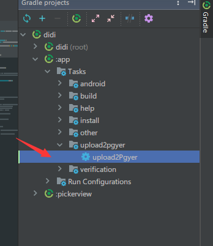
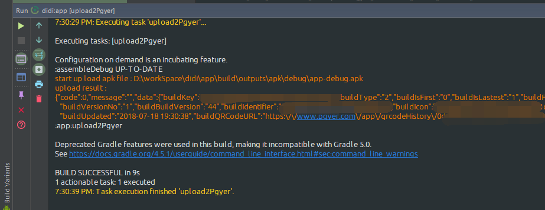

# A gradle task that uploads your app to www.pgyer.com , 让你更方便的上传你的apk到蒲公英

# 基于Gradle支持Android Studio的蒲公英自动上传task

最近的项目中在使用[蒲公英](https://www.pgyer.com/)作为面向客户的App预览平台,虽然没有Jenkins这么强大,但是面向客户的话还是很方便的.但是在使用的过程中,需要到网页手动上传不是很方便,蒲公英都相应的Api接口,可以进行上传操作,我就想是需要一个快捷上传的方式了.

## 实现思路

Android Studio使用Gradle作为构建工具,Gradle的功能是十分强大的,可以自定义Plugin hook构建过程中的各个阶段.今天的任务比较简单,不用单独写插件那么麻烦,就写一个task就可以了.

## 实现过程

### 获取apk路径

既然要上传apk,那不管怎么样首先肯定是要得到apk文件了.在android插件的配置闭包中我们可以通过下面的方式拿到输出的apk文件.

```groovy
applicationVariants.all {
                        it.outputs.each { out ->
                            def outputFile = out.outputFile
                            if (outputFile != null && outputFile.name == 'app-debug.apk') {
                               //在这里outputFile就是debug生成的apk了
                            }
                        }
                    }
```

### 调用接口进行上传

- 在.gradle文件中可以直接调用的网络库是`java.net.HttpURLConnection`,我很久没用过了,感觉用起来也不是很方便,于是就想使用熟悉一点点的OkHttp来进行上传操作.但是OkHttp不是java自带的库,默认在.gradle文件中是无法调用的,怎么才能在.gradle文件中引用第三方库呢?答案是加入classpath引入:

  ```groovy
  import okhttp3.OkHttpClient//2.导入
  
  buildscript {
      repositories {
          jcenter()
      }
      dependencies {
          classpath 'com.squareup.okhttp3:okhttp:3.11.0'//1.添加依赖
      }
  }
  
  OkHttpClient client = new OkHttpClient()//3.可以用了
  ```

  引入了网络库,开搞吧.

  ```groovy
  URL url = new URL('https://www.pgyer.com/apiv2/app/upload')
   MediaType type = MediaType.parse("multipart/form-data")
   OkHttpClient client = new OkHttpClient()
   def build = new MultipartBody.Builder()
   build.addFormDataPart("file", outputFile.getName(), RequestBody.create(MediaType.parse('"application/octet-stream"'), outputFile))
   build.addFormDataPart("_api_key", "_api_key_api_key_api_key")
   build.addFormDataPart("userKey", "userKeyuserKeyuserKey")
   build.addFormDataPart("buildUpdateDescription", "uat服务器 debug")
  def body = build.build()
  logger.log(LogLevel.ERROR, "upload scusses : ${body.toString()}")
   Request request = new Request.Builder()
       .url(url)
       .addHeader("_api_key", "_api_key_api_key_api_key")
       .post(body)
       .build()
  
   Response response = client.newCall(request).execute()
   if (response.isSuccessful()) {
            logger.log(LogLevel.ERROR, "upload scusses : ${response.body().string()}")
            } else {
             logger.log(LogLevel.ERROR, "upload failure : ${response.message()}")
     }
  ```

  以为这样就好了?我也是这么以为,但是上传服务器都提示我\_api_key未配置,但是我明明的配置了的呀,不管我把\_api_key addFormDataPart() 还是addHeader() 都是一样的,直到我把它作为Query进行拼接.`https://www.pgyer.com/apiv2/app/upload?_api_key=_api_key_api_key_api_key` 这样才没有再报 \_api_key未配置的问题,但是新的问题是说我的apk文件为null.这样我就比较无语了,不知道是我的写法有问题还是他们的后台有问题.

- 在OkHttp行不通以后本来想用HttpURLConnection再行尝试,但是我注意到蒲公英的Api中说可以使用curl进行上传,curl我在用Linux的时候也用过几次,几乎的陌生的.但是我知道它很强大.百度百科:*curl*是利用URL语法在命令行方式下工作的开源文件传输工具。它被广泛应用在Unix、多种Linux发行版中，并且有DOS和Win32、Win64下的移植版本。(我的win10已经有curl了,可能是装Git的时候一起装的,如果你的电脑没有安装的话,请百度安装.)curl是一个命令行的工具,在Android Studio中怎么调用呢?当然是使用`java.lang.Runtime`类了,简单方便.调用如下;

  ```groovy
   Runtime runtime = Runtime.getRuntime()
   Process p = runtime.exec(uploadCommand)//执行命令
   InputStream fis = p.getInputStream()
   InputStreamReader isr = new InputStreamReader(fis)
   BufferedReader br = new BufferedReader(isr)
   String line = null
   logger.log(LogLevel.ERROR, "upload result :")
   while ((line = br.readLine()) != null) {//读取结果
       logger.log(LogLevel.ERROR, line)
   }
   br.close()
   isr.close()
   fis.close()
  ```

  

### 打开结果上传结果页面

上传完成后可能想看看效果,或者截取安装二维码发送给客户,这时候需要打开上传结果页面,上传的接口返回了这个页面的短连接,拼接一下就能得到地址,再调用Runtime打开浏览器就ok了,so easy.

```groovy
  String sUrl = line.substring(start, end)
  runtime.exec("cmd   /c   start  https://www.pgyer.com/$sUrl")
```


## 优化

经过上面的步骤,上传就完成了,但是现在这个task是写在app模块的build.gradle文件中的,如果别的项目要使用需要复制修改,而且也让这个这个文件显得比较繁杂.现在可以优化的是把这个上传任务从这个文件中抽取出来,单独放到一个文件中.方便复用,整洁代码.这个用到的是gradle的脚本插件功能.	

- 在工程根目录新建一个dandelionUpload.gradle文件,把task拷贝到里面.

- 然后在app模块的build.gradle文件中引用这个脚本插件.

  ~~~groovy
  apply from: "${rootProject.rootDir}/dandelionUpload.gradle" //引入
  android {
      ``````
      project.ext.upload2d project,"这里是上传的描述"//引用插件并传入参数
  }
  ~~~

  

这样就达到了方便复用的目的,同时也保持了app模块的build.gradle文件的清爽.

## 使用
下载pgyerUpload.gradle文件引入后修改为自己的key,添加完成task,同步过后,在



这里会出现一个任务点击一下就OK了.



这个任务默认上传的是debug模式下的包(你如果要上传别的包请自行修改),因为依赖于assembleDebug任务,如果包不存在的话会调用assembleDebug进行构建,完成后上传.

完整代码[在这里](https://github.com/longforus/pgyerUpload4AndroidStudio),东西很简单,但是还算有用吧.如果对你有帮助欢迎star,你的star是我的动力.
